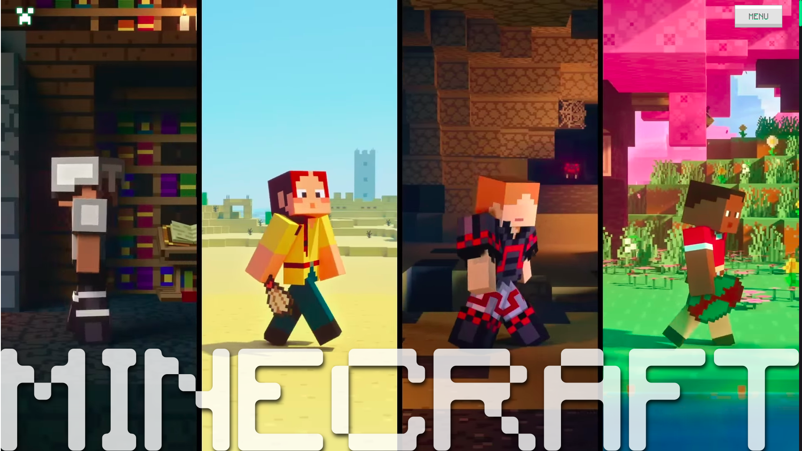
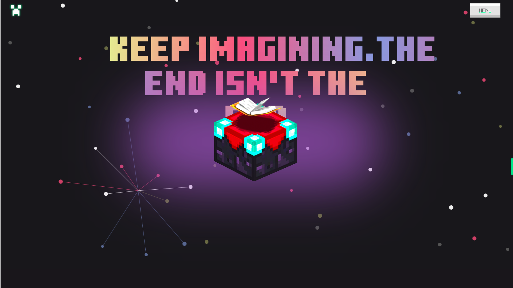
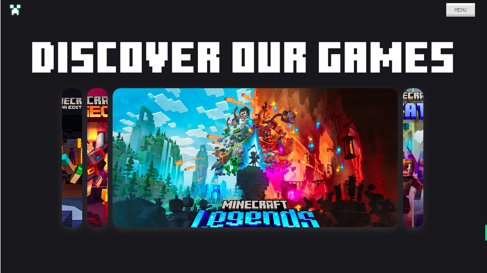

# Minecraft Redesign Website

**Website URL**: [Minecraft Redesign](https://minecraft-redesigned.netlify.app/)

A visually modern redesign of the classic Minecraft website, bringing in new aesthetics while maintaining the essence of the original game. Explore a refreshing user experience with smooth animations and engaging 3D elements.

## Technologies Used
- **React**: For building the user interface.
- **Tailwind CSS**: For responsive and modern UI styling.
- **GSAP**: For advanced animations and scroll-triggered effects.
- **Spline**: To integrate and manage 3D models.
- **Framer Motion**: For smooth animations and interactions.

## Author
**Sayan Das**

Feel free to explore and give feedback!

## Here are some snapshots of the redesigned Minecraft website:

- **Homepage Section**  

- **3d Element Design**  

- **Beautiful Layouts**  
